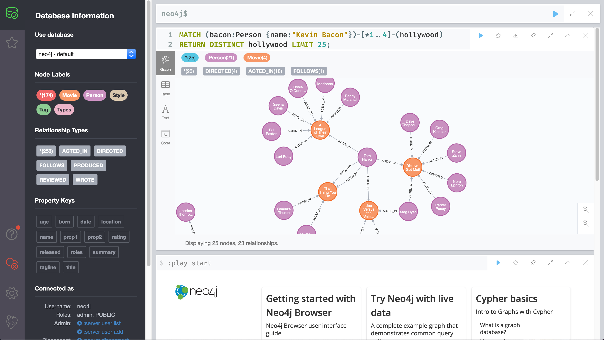

# Neo4j Browser

Neo4j Browser is the general purpose graphical user interface for Neo4j.



## Demo

You can try out the latest (unreleased) version of Neo4j Browser at [http://browser-canary.graphapp.io/](http://browser-canary.graphapp.io/).

Keep in mind that you will need to connect to an instance of Neo4j (the database) for most operations in Neo4j Browser. A simple way to get started is through [Neo4j Desktop](https://neo4j.com/download/). Once you've started a database it's by default available for Neo4j Browser to connect to on **localhost:7687**.

## Feedback & Contributing

Found a bug or some other problem with Neo4j Browser? Please [**open an issue**](https://github.com/neo4j/neo4j-browser/issues)

Have an idea for a new feature? You're welcome to leave suggestions and ideas [here](https://neo4j-browser.canny.io/feature-requests)

Contributions welcome! More information in our [CONTRIBUTING.md](CONTRIBUTING.md).

## Development 
Running Neo4j Browser locally requires Node.js (^12.4.0) and yarn (`npm install -g yarn`).

```shell
yarn
yarn start
```

The development server will then be reachable at `http://localhost:8080`. 

### Testing overview
Neo4j Browser has both unit and end to end tests running automatically on every pull request. To run the tests locally:

`yarn test-unit` runs a linter and then our unit tests.
`yarn test-e2e` runs our Cypress end to end tests in the easiest and slowest way. Running them with this command requires docker installed and that nothing else runs on ports 7687 and 8080.

#### Cypress e2e test suite in depth

`yarn e2e-open` to open the Cypress test runner (requires a **fresh** installation of Neo4j to run against, expects neo4j 3.5 by default). See details below on how to configure database version.

`yarn e2e-local-open` to run against an existing server (with a password already set). We use `newpassword` as the default password here, make sure to pass your password:
`yarn e2e-local-open --env browser-password=<your-password-here>`

To avoid opening the Cypress test runner and just run the tests in the terminal, remove the "-open" suffix from the previous two commands (so `yarn e2e` and `yarn e2e-local` respectively).

So to run tests on your existing 4.2 database with the password "hunter2" without opening the Cypress visual test runner:
`yarn e2e-local --env browser-password=hunter2,server=4.2`

All the available options for `--env` are:
```
server=3.5|4.0|4.1|4.2 (default 3.5)
edition=enterprise|community|aura (default enterprise)
browser-password=<your-pw> (default 'newpassword')
include-import-tests=true|false (default false)
bolt-url=<bolt url excluding the protocol> (default localhost:7687)
```

There are some additional options that can only be set as system environmental variables (meaning they cannot be set using the `--env` flag as the ones above).
These needs to be set before the test command is run.

```
CYPRESS_E2E_TEST_ENV=local|null (if the initial set of pw should run or not) (default undefined)
CYPRESS_BASE_URL=<url to reach the browser to test> (default http://localhost:8080)
```

Example: `CYPRESS_E2E_TEST_ENV="local" CYPRESS_BASE_URL=http://localhost:30000 cypress open --env server=3.5`
