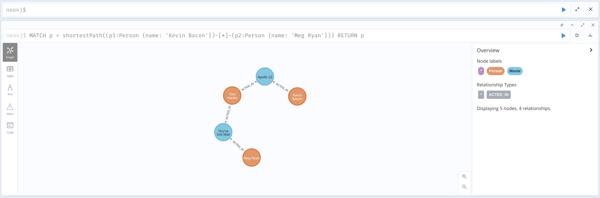
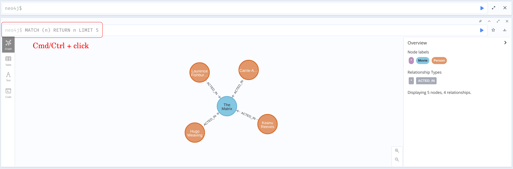

Images.

`about.png`


`browser-with-aura.png`


`browser-with-desktop.png`


`browser-with-sandbox.png`


`code.png`


`command-palette.png`


`configs.png`


`database-information.png`


`download-csv-json.png`


`download_csv.png`


`download-graph.png`


`download_graph.png`


`favorites.png`


`find-replace.png`


```
graph.png
MATCH p = shortestPath((p1:Person {name: 'Kevin Bacon'})-[*]-(p2:Person {name: 'Meg Ryan'})) RETURN p
```



```
graph_result_frame_style_node_selected_properties.png
MATCH p = shortestPath((p1:Person {name: 'Kevin Bacon'})-[*]-(p2:Person {name: 'Meg Ryan'})) RETURN p
```


```
graph_result_frame_style_overview.png
MATCH p = shortestPath((p1:Person {name: 'Kevin Bacon'})-[*]-(p2:Person {name: 'Meg Ryan'})) RETURN p
```


```
graph_result_frame_style_overview_node.png
MATCH p = shortestPath((p1:Person {name: 'Kevin Bacon'})-[*]-(p2:Person {name: 'Meg Ryan'})) RETURN p
```


```
graph_result_frame_style_overview_relationship.png
MATCH p = shortestPath((p1:Person {name: 'Kevin Bacon'})-[*]-(p2:Person {name: 'Meg Ryan'})) RETURN p
```


```
graph_result_frame_style_relationship_selected_properties.png
MATCH p = shortestPath((p1:Person {name: 'Kevin Bacon'})-[*]-(p2:Person {name: 'Meg Ryan'})) RETURN p
```


`guides.png`


`help.png`


`home-screen.png`


`inline-result-editor.gif`


`overview.png` 


`play-start.png`


`product_analytics_consent_browser_running_in_aura.png`


`product_analytics_consent_browser_running_in_desktop.png`


`product_analytics_consent_browser_settings.png`


`result-frame.png`



`sample-scripts.png`


`screen_editor.png`


`screen_stream.png`


`settings.png`


`sync.png`


`sysinfo_stats.png`


`table.png`


`text.png`


