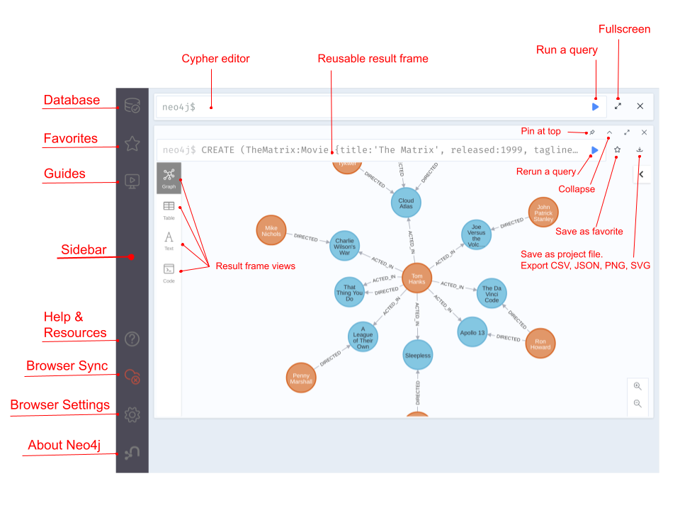

Images.

`about.png`

`browser-with-aura.png`

`browser-with-desktop.png`

`browser-with-sandbox.png`

`code.png`

`command-palette.png`

`configs.png`

`database-information.png`

`download-csv-json.png`

`download_csv.png`

`download-graph.png`

`download_graph.png`

`favorites.png`

`find-replace.png`

`graph.png`

`guides.png`

`help.png`

`home-screen.png`

`inline-result-editor.gif`

`overview.png` 

`play-start.png`

`result-frame.png`

`sample-scripts.png`

`screen_editor.png`

`screen_stream.png`

`settings.png`

`style_actedin_relationship.png`

`style_movie_node.png`

`sync.png`

`sysinfo_stats.png`

`table.png`

`text.png`

